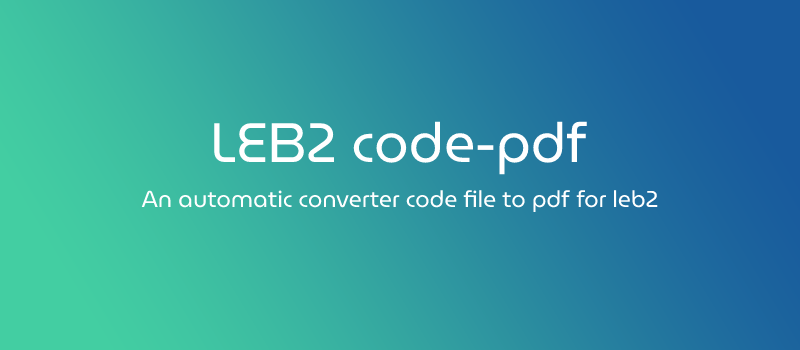
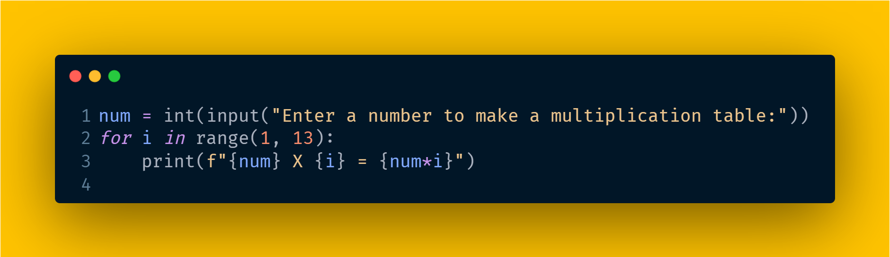
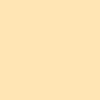

<br> Save your time by automatically converting **python** code files into pdf files, for KMUTT college students.
<br> **LEB2** (Learning Environment version B2) https://www.leb2.org/
## Installation
```sh
git clone https://github.com/monshinawatra/leb2code-pdf.git
cd leb2code-pdf
pip install -r requirements.txt
```
## Quick start
**Inference** with `leb2code.py` 
```
python leb2code.py "ชินวัตร นาไชยธง"      # Full name
                   "65090500408"        # KMUTT id
                   -d "lab5"            # Code files directory
                   -bg "Red (NCS)"      # Background color
                   -o "output/lab5.pdf  # Save path
                   -l                   # Show line number
```

Arguments parsing list
<br> `-h, --help` show this help message and exit
<br> `-d <Dir>, --directory <Dir>` Enter code directory
<br> `-k <Keyword>, --keyword <Keyword>` Enter file keyword
<br> `-bg <Color>, --background_color <Color>` Enter color name or Hex color code
<br> `-t <Theme>, --theme <Theme>` Enter Color theme
<br> `-f <Font family>, --font <Font family>` Enter font name (See all font names in carbon exported config)
<br> `-s <Font size>, --font_size <Font size>` Enter size of the font
<br> `-l, --line_numbers` Turn on/off line number
<br> `-w <Width (px)>, --width <Width (px)>` Width of code snippets
<br> `-o <Path>, --save_path <Path>` Enter destination path for saving pdf

**Inference** in `app.py` arguments
|          Arguments        |   Default             | Type  |  Description |
| ------------------------- | --------------------- |:-----:| ------------------------------------------- |
| `name` (required)         |                       | str   | Your full name. e.g. `ชินวัตร นาไชยธง`, `Shinawatra Nachaithong`
| `id` (required)           |                       | str   | Your **KMUTT** college student id. e.g.  `65090500000`
| `dir`                     | `"./"`                | str   | Your code directory
| `language`                | `"Python"`            | str   | Code language. `'python'` by default and `'plain-text'` for output image
| `keyword`                 | `"lab"`               | str   | All your unique code file name
| `backgroundColor`         | `"Golden Poppy"`      | str   | Background color. See all <a href="https://github.com/monshinawatra/leb2code-pdf/#color-and-theme">color names</a>, <br>or use custom HEX color code instead
| `theme`                   | `"Night Owl"`         | str   | Color theme in code snippets
| `fontFamily`              | `"Fira Code"`         | str   | Font family, e.g. `JetBrains Mono`, `Fira Code`. <br>See all names in carbon exported config
| `fontSize`                | `16`                  | int   | Just size of font in code snippets
| `lineNumbers`             | `False`               | bool  | Turn on/off line number
| `width`                   | `680`                 | int   | Width of code snippets
| `save_path`               | `"demo.pdf"`          | str   | Output path for pdf file
| `paddingVertical`         | `"50px"`              | str   | Vertical padding
| `paddingHorizontal`       | `"50px"`              | str   | Horizontal padding

## Results
Here is the result from <a href="https://carbon.now.sh/">carbon</a> `"Golden Poppy"`
<br>


## Color and theme
**Support themes**
<br> `Zenburn` `Yeti` `VSCode` `Verminal` `Twilight` `SynthWave` `Solarized (Light)` `Solorarized (Dark)` `Shades of Purple` `Seti` `Paraiso` `Panda` `One Dark` `One Light` `Oceanic Next` `Nord` `Night Owl` `Monokai` `Material` `Lucario` `Hopscotch` `Duotine` `Cobalt` `Blackboard`
<br>
<br>
**Color Name**
You can use these as a color name, if you don't like these colors, you can use custom hex color code instead.

|             Color                 |   Name              |             Color                 |   Name              |             Color                 |   Name              |
| --------------------------------- | ------------------- | --------------------------------- | ------------------- | --------------------------------- | ------------------- |
|    | `"White"`           |   | `"Golden Poppy"`    |   | `"Teal"`
|    | `"Silver"`          |   | `"Neon Orange"`     |   | `"Blue"`
|    | `"Gray"`            |   | `"Bright Orange"`   |   | `"Sapphire Blue"`   
|    | `"Black"`           |   | `"Yellow"`          |   | `"Midnight Blue"`   
|    | `"Brown Chocolate"` |   | `"Emerald Green"`   |   | `"Navy"`
|    | `"Crimson"`         |   | `"Lime"`            |   | `"Purple"`
|    | `"Violet Red"`      |   | `"Green"`           |   | `"Byzantium"`       
|    | `"Rose Red"`        |   | `"Aqua"`            |   | `"Pastel Pink"`     
|    | `"Red (NCS)"`       |   | `"Blue Green"`      |   | `"Pastel Red"`      
|    | `"Red"`             |   | `"Jade"`            |   | `"Salmon"`
|   | `"Cinnamon"`        |   | `"Jungle Green"`    |   | `"Peach"`
|   | `"Portland Orange"` |   | `"Viridian"`
## Task
- [x] Main application.
- [x] Refactor our code.
- [x] Arguments parsing.
- [ ] Beautify code snippets, layout, label in pdf file.

## Reference
**Carbon** <br>
Create and share beautiful images of your source code
https://carbon.now.sh/

**Carbon API**
https://github.com/petersolopov/carbonara

**PyFPDF** <br>
Free and open-source pure-python PDF library
https://github.com/PyFPDF/fpdf2
